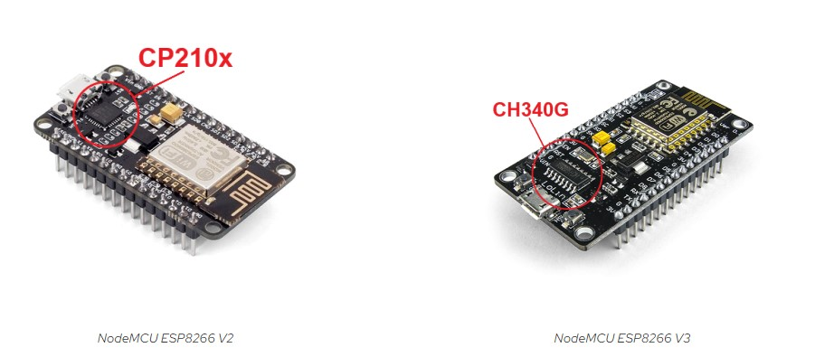

# ESP8266 - WEB Requests

Este projeto é uma implementação simples de requisições HTTP usando o ESP8266. O código foi desenvolvido com fins didáticos e é gratuito para qualquer pessoa que o obtenha.

## Apoio

Este(s) material(is) foi(am) utilizado(s) de apoio para o desenvolvimento deste conteúdo:

- [Instalação do driver do NodeMCU](https://www.robocore.net/tutoriais/instalando-driver-do-nodemcu?srsltid=AfmBOopUhDuV8Pjk_UQS4H_g-5vd_s1_lzEp2dl_mL9RVlbjDUUiDpTS)

## Descrição

Este software permite que um dispositivo ESP8266 se conecte a uma rede Wi-Fi e envie requisições HTTP GET para um servidor. Os dados são enviados periodicamente, utilizando um número aleatório como exemplo. A implementação faz uso de conexões HTTPS para garantir a segurança nas comunicações.

## Funcionalidades

- Conexão com Wi-Fi
- Envio de requisições HTTP GET
- Geração de números aleatórios para testes
- Suporte a HTTPS

## Requisitos

- Placa ESP8266 (versão 3.0.0 ou superior)
- Biblioteca `ESP8266WiFi`
- Biblioteca `ESP8266HTTPClient`
- Biblioteca `WiFiClientSecureBearSSL`

### Drivers

Parece coisa do passado (kkk), mas pode ser necessária a instalação dos drivers para a comunicação do ESP com a IDE do Arduíno (ou qualquer outra que esteja utilizando).

Há uma pasta de drivers dentro do projeto com dois arquivos, um para o modelo V2 e outro para o modelo V3. Para saber qual é o seu, veja a imagem a seguir:

  
Fonte: [Robocore](https://www.robocore.net/tutoriais/instalando-driver-do-nodemcu)

## Como Usar

1. **Configuração do Wi-Fi**: 
   - Altere as variáveis `ssid` e `password` com os detalhes da sua rede Wi-Fi.

2. **Defina o Endereço do Servidor**:
   - Modifique a variável `serverName` com o endereço do seu endpoint. O exemplo atual é `https://fredaugusto.com.br/teste/enviar_dados.php`.

3. **Ajuste o Intervalo de Requisições**:
   - A variável `timerDelay` define o tempo em milissegundos entre cada requisição. O padrão é 5000 ms (5 segundos).

4. **Parâmetros da Requisição**:
   - Você pode adicionar parâmetros à requisição GET na string `serverPath`, seguindo o formato: `?chave=valor`.

5. **Compilar e Carregar**:
   - Compile e faça o upload do código para sua placa ESP8266 usando o Arduino IDE.

## Códigos

### `connectWIFI_esp8266_basic.ino`
Este arquivo contém um modelo de conexão e requisições GET básicos. O código estabelece uma conexão com a rede Wi-Fi especificada e envia requisições HTTP GET para um servidor. Todos os parâmetros e configurações são definidos diretamente no código, permitindo uma rápida implementação e entendimento dos conceitos fundamentais. É ideal para quem está começando a trabalhar com ESP8266 e deseja aprender sobre conexões e requisições de forma simples.

### `connectWIFI_esp8266_advanced.ino`
Neste arquivo, implementamos funcionalidades adicionais para o ESP8266, incluindo feedback visual através de LEDs. O LED integrado da placa indica o status da conexão, proporcionando uma experiência interativa e facilitando a depuração. Quando o ESP8266 está tentando se conectar ao Wi-Fi, o LED pisca em intervalos regulares. Uma vez conectado, ele permanece aceso continuamente, sinalizando que a conexão foi bem-sucedida.

Esse tipo de feedback é extremamente útil durante o desenvolvimento e testes, pois permite que o usuário saiba rapidamente se o dispositivo está ativo e se a conexão está funcionando. Além disso, essa implementação é um passo importante para quem deseja adicionar elementos de feedback visual a projetos mais complexos, como sistemas de monitoramento ou automação residencial.

### `connectWIFI_esp8266_AP_advanced.ino`
Este arquivo apresenta uma abordagem mais avançada para gerenciar a conexão do ESP8266. Caso o dispositivo não consiga se conectar ao ponto de acesso configurado, ele automaticamente cria um ponto de acesso próprio. Isso permite que usuários acessem uma interface web onde podem alterar as configurações de conexão de forma intuitiva.

Ao conectar-se a esta rede, o usuário pode acessar uma página HTML através de um navegador, que oferece um formulário para modificar o SSID e a senha da rede Wi-Fi desejada. Essa funcionalidade é especialmente útil em cenários onde o dispositivo precisa ser facilmente configurável sem a necessidade de reprogramação.

Essa abordagem torna o ESP8266 uma solução flexível para diversos projetos, permitindo que ele atue como um ponto de configuração inicial para dispositivos IoT. Ao facilitar a conexão e a configuração através de uma interface web, o projeto se torna mais acessível, mesmo para usuários que não possuem experiência técnica avançada.

## Contribuições

Contribuições são bem-vindas! Sinta-se à vontade para abrir issues ou enviar pull requests.

## Licença

Este projeto é de domínio público e pode ser utilizado livremente.
